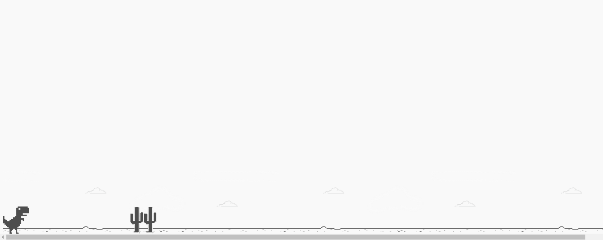

# dino-game
### Remake Dino-game of Google

In this project was used the concepts learned from Dio'courses about javascript, such as:

- Functions;
- Object Oriented Programming;
- <b>This</b> concept;
- Modules.

## Demo




To start the project, run the <b>yarn</b> command.

```
  $ yarn
```
